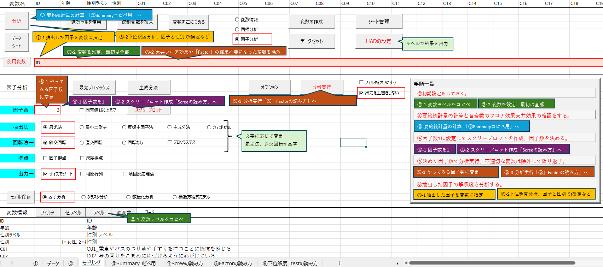

# HAD_FactorAnalaysCustom
HADを因子分析用にカスタマイズしました。　バージョンは18_006ですが、シートの複製で別バージョンもいけると思います。
## 用途

## 使い方
このページの上の方にファイル一覧が表示されているので、「因子分析用・HAD18_006.xlsm」をご自分のPCにダウンロードしてください。  
シートの左から①②と表示させて注意書きを読み進めると因子分析できるようになっています。

### ライセンスについて
本家HADに従ってGPL になります。　コピーレフトなのをご理解の上でご利用ください。
https://osf.io/32cyp/wiki/%E3%83%A9%E3%82%A4%E3%82%BB%E3%83%B3%E3%82%B9/

### 謝辞と引用元
清水先生、HADの開発と配布ありがとうございます。  
放送大学でもお世話になりましたし、現所属の大学院でもHADのお世話になっております。  
  
研究事例で学ぶSPSSとAmosによる心理・調査データ解析 第3版 小塩真司 著　  
・清潔志向性尺度の作成と男女比較　  
を使用しています。 授業でお世話になりました、ありがとうございます。
