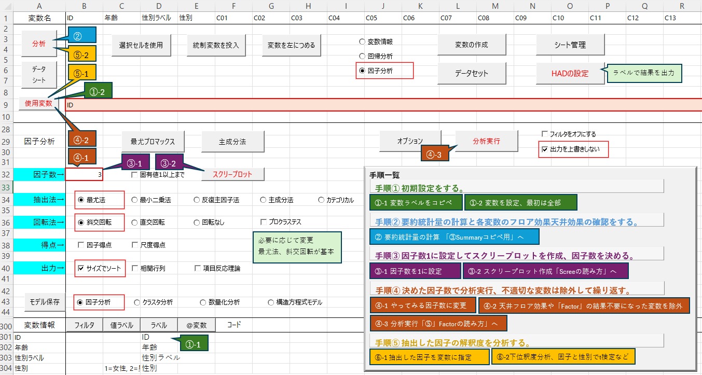

# HAD_FactorAnalaysCustom
HADを因子分析用にカスタマイズしました。　ベースになっているバージョンは18_006ですが、シートの複製で別バージョンもいけると思います。
  
## 用途
一度は HAD で因子分析を使ってみたものの、次に忘れていそうな人(自分を含む)のために、作ってみました。  
使うところだけを赤字、赤枠にして、分析する順番で番号を振って注釈をつけました。  
  
## 使い方
このページ  
https://github.com/temochiz-lab/HAD_FactorAnalaysCustom/tree/main  
の上の方にファイル一覧が表示されているので、「因子分析用・HAD18_006.xlsm」をご自分のPCにダウンロードしてください。  
  
シートの左から①②と表示させて注意書きを読み進めると因子分析できるようになっています。

## 各シートの説明
とにかく左から①②とやっていけば良いのですが、HADの仕様で、「データ」「モデリング」というシート名は固定なので、便宜上「①」「②」というシートを作ってあります。  
#### ① データ
データ入力用シートです。
注意書きの通りにデータを入力します。

### ライセンスについて
本家HADに従ってGPL になります。　コピーレフトなのをご理解の上でご利用ください。
[HADのライセンス](https://osf.io/32cyp/wiki/%E3%83%A9%E3%82%A4%E3%82%BB%E3%83%B3%E3%82%B9/)

### 謝辞と引用元
清水先生、HADの開発と配布ありがとうございます。  
放送大学でもお世話になりましたし、現所属の大学院でもHADのお世話になっております。  
  
例として使っているデータは、研究事例で学ぶSPSSとAmosによる心理・調査データ解析 第3版 小塩真司 著　より、  
・清潔志向性尺度の作成と男女比較　  
を使用しています。 授業でお世話になりました、ありがとうございます。
