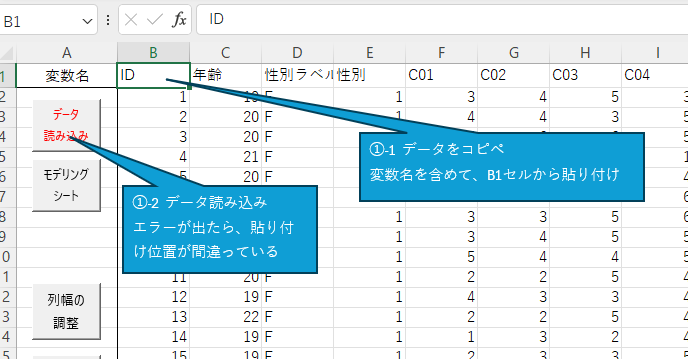
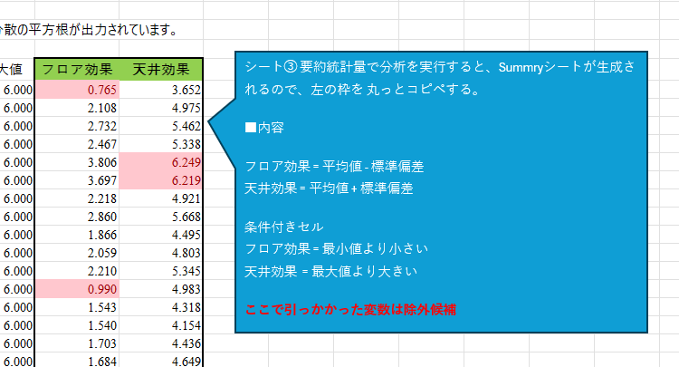
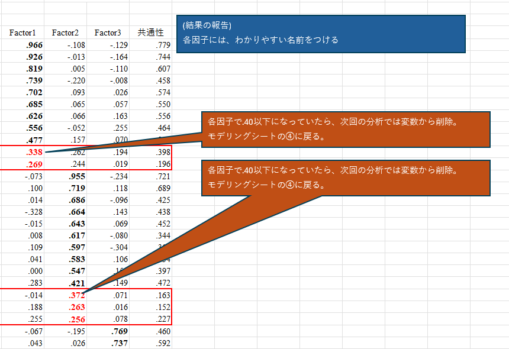
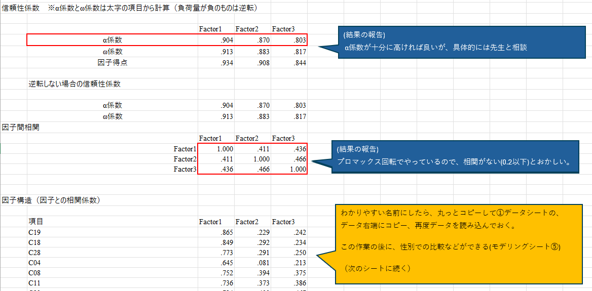
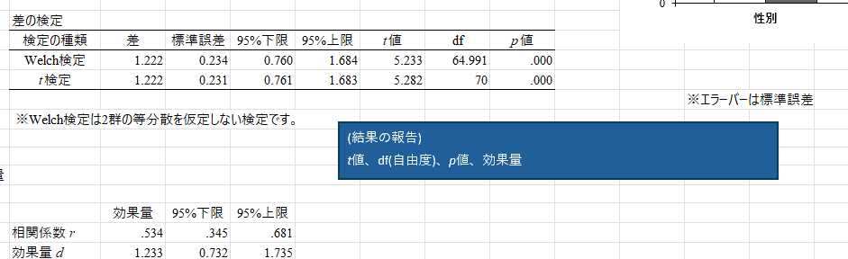

# HAD_FactorAnalaysCustom
HADを因子分析用にカスタマイズしました。　ベースになっているバージョンは18_006ですが、シートの複製で別バージョンもいけると思います。
  
## 用途
一度は HAD で因子分析を使ってみたものの、次に忘れていそうな人(自分を含む)のために、作ってみました。  
使うところだけを赤字、赤枠にして、分析する順番で番号を振って注釈をつけました。  
  
## 使い方
このページ  
https://github.com/temochiz-lab/HAD_FactorAnalaysCustom/tree/main  
の上の方にファイル一覧が表示されているので、「因子分析用・HAD18_006.xlsm」をご自分のPCにダウンロードしてください。  
  
シートの左から①②と表示させて注意書きを読み進めると因子分析できるようになっています。

## 各シートの説明
とにかく左から①②とやっていけば良いのですが、HADの仕様で、「データ」「モデリング」というシート名は固定なので、便宜上「①」「②」というシートを作ってあります。  

#### ① データ
データ入力用シートです。  
注意書きの通りにデータを入力します。  

#### ② モデリング
計算する操作のメインになるシートです。  
書かれている手順に沿って番号を探して入力や設定をして進めます。  

#### ③ summary用コピペシート
基本統計量を計算した後は、手動でフロア効果と天井効果を計算しますが、毎度手入力も面倒なので、このシートからコピペすることで済ませられます。

#### ④ screeの見方シート
因子数の決定にあたっては、スクリープロットや HAD のオススメを参考にしますが、ど忘れてした際に参考にするシートです。

#### ⑤ factor の見方シート
分析実行したあとには、使わない変数を削除して再計算する作業があるので、思い出すために使います。

終わった後には、因子分析の結果報告と、下位尺度の計算などがありますので、やりかたを思い出すために使います。

#### ⑥ 下位尺度 の見方シート
因子分析が終わってからが本当の分析だと思い出すために使います。

### ライセンスについて
本家HADに従ってGPL になります。　コピーレフトなのをご理解の上でご利用ください。
[HADのライセンス](https://osf.io/32cyp/wiki/%E3%83%A9%E3%82%A4%E3%82%BB%E3%83%B3%E3%82%B9/)

### 謝辞と引用元
清水先生、HADの開発と配布ありがとうございます。  
放送大学でもお世話になりましたし、現所属の大学院でもHADのお世話になっております。  
  
例として使っているデータは、研究事例で学ぶSPSSとAmosによる心理・調査データ解析 第3版 小塩真司 著　より、  
・清潔志向性尺度の作成と男女比較　  
を使用しています。 授業でお世話になりました、ありがとうございます。
