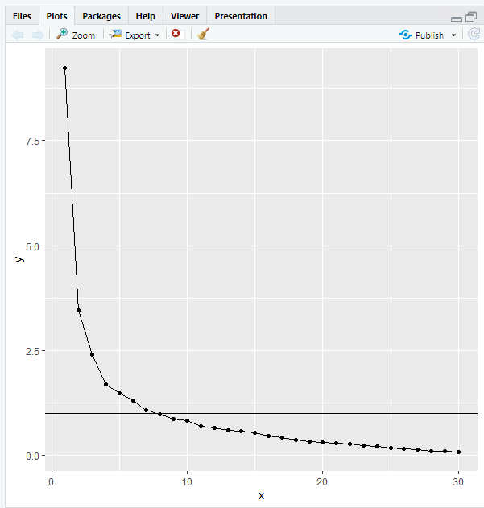
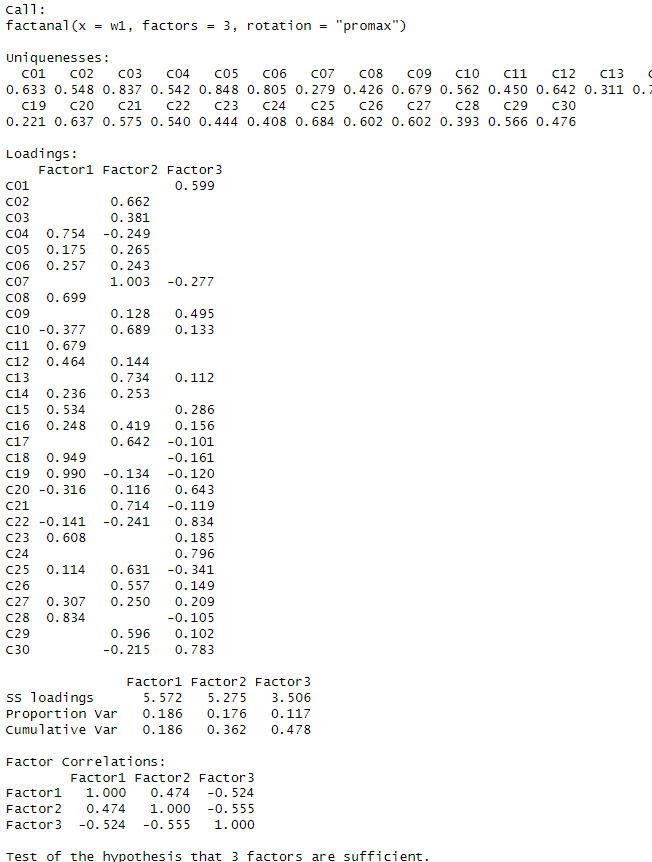
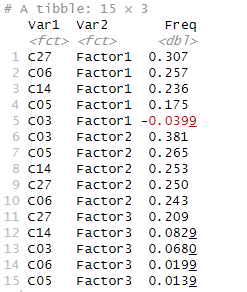

# R で因子分析をするまでのメモ
こういった小さなコードはChatGPTが得意なので、マニュアル代わりに対話しながら進めるのが楽ちん。

## インストールまで

### (1) Rのダウンロード  
https://cran.rstudio.com/bin/windows/base/
  
### (2) R Studioのダウンロード  
https://posit.co/download/rstudio-desktop/#download
  
### (3) R Markdownの有効化  
\# 自動でダウンロード、インストールされる  
\# 下記メニューから選択  
File -> NewFile -> R Markdown
  
### (4) ggplotのインストール  
\# tidyverseパッケージをインストールして有効化  
install.packages("tidyverse")  
library(tidyverse)  
  
## 因子分析する
  
### (1) ファイルの読み込み  
w1 <- read.csv("hoge.csv")  
\# 数値データのみを選択  
w1 <- w1[sapply(w1, is.numeric)]  
  
### (2) 相関を計算  
w2 <- cor(w1)  
y <- eigen(w2)$values  
x <- 1:length(y)  
  
### (3) スクリープロットの作成  
library(tidyverse)  
\# プロットを確認  
ggplot() + geom_point(aes(x = x, y = y)) + geom_line(aes(x = x, y = y)) + geom_hline(yintercept = 1)  

  
### (4) 因子分析  
\# 3因子でやってみた場合  
fit <- factanal(w1, factors = 3, rotation = "promax")  
  
  
  
### (5) 削除候補の変数を探す  
    
\# 因子負荷行列の抽出  
loadings <- fit$loadings  
  
\# 因子負荷行列をデータフレームに変換  
loadings_df <- as.data.frame(as.table(loadings))  
  
\# データフレームの確認  
print(head(loadings_df))  
  
\# 各因子の負荷量をVar2でソートし、次にFreqの絶対値でソート  
sorted_loadings <- loadings_df %>% arrange(Var2, desc(abs(Freq)))  
  
\# Factor1, Factor2, Factor3 すべてで Freq が 0.40 以下の行を抽出  
filtered_loadings <- sorted_loadings %>% group_by(Var1) %>% filter(all(abs(Freq) <= 0.40)) %>% ungroup()  
  
\# 抽出された行の表示  
print("Filtered Loadings (All Freq <= 0.40):")  
print(filtered_loadings)  

  


```
# (1) ファイルの読み込み
w1 <- read.csv("C:/Users/temoc/Desktop/seiketsu.csv")

# 数値データのみを選択
w1 <- w1[sapply(w1, is.numeric)]

# (2) 相関を計算
w2 <- cor(w1)
y <- eigen(w2)$values
x <- 1:length(y)

# (3) スクリープロットの作成
library(tidyverse)

# プロットを確認
ggplot() + 
  geom_point(aes(x = x, y = y)) + 
  geom_line(aes(x = x, y = y)) + 
  geom_hline(yintercept = 1)

# (4) 因子分析
fit <- factanal(w1, factors = 3, rotation = "promax")

# 因子負荷行列の抽出
loadings <- fit$loadings

# 因子負荷行列をデータフレームに変換
loadings_df <- as.data.frame(as.table(loadings))

# データフレームの確認
print(head(loadings_df))

# 各因子の負荷量をVar2でソートし、次にFreqの絶対値でソート
sorted_loadings <- loadings_df %>%
  arrange(Var2, desc(abs(Freq)))

# Factor1, Factor2, Factor3 すべてで Freq が 0.40 以下の行を抽出
filtered_loadings <- sorted_loadings %>%
  group_by(Var1) %>%
  filter(all(abs(Freq) <= 0.40)) %>%
  ungroup()

# 抽出された行の表示
print("Filtered Loadings (All Freq <= 0.40):")
print(filtered_loadings)
```

## その他メモ
・スクリプトの実行は、"Source"、1ステップ実行が"Run"
